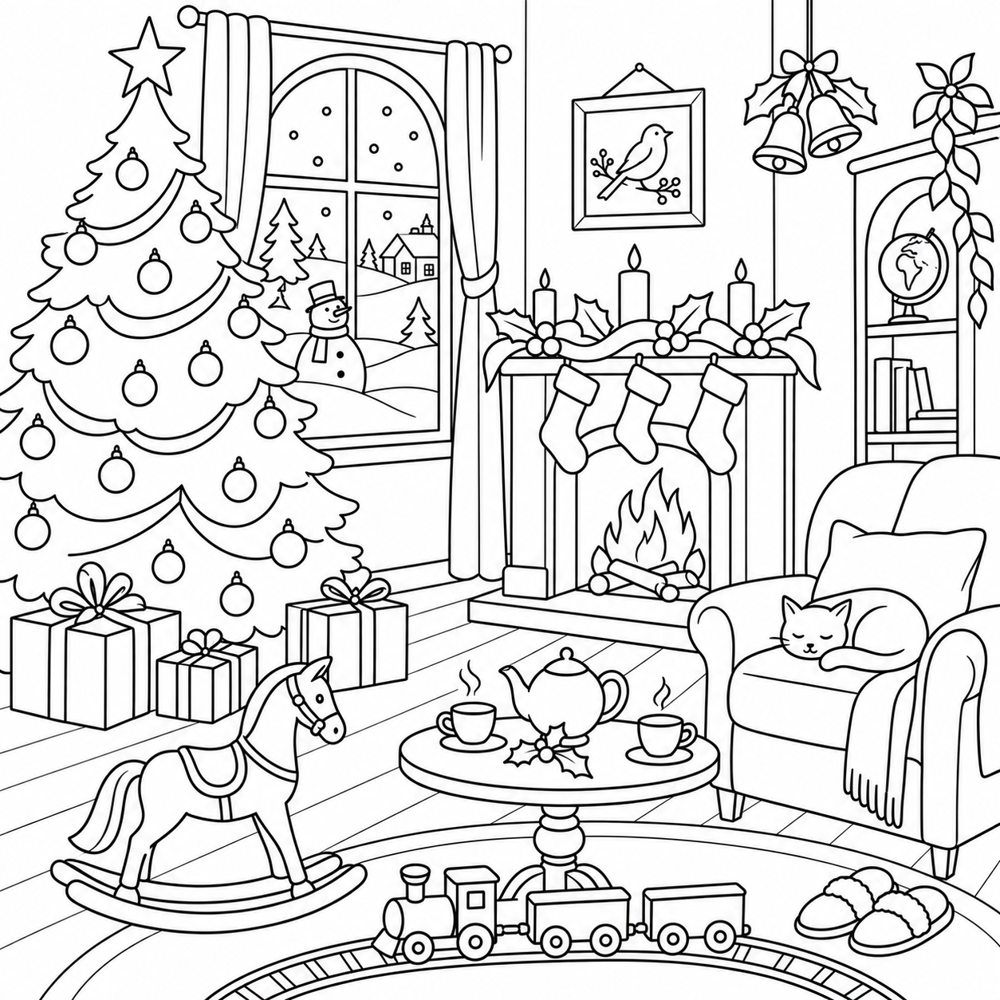

# Sudoku-unlocked dot-to-dot advent calendar

## Chosen approach

Create **one continuous Christmas scene across 25 daily puzzles**, assembled in a **5×5 layout**. Each day combines a Sudoku, a printed lookup and a concealed dot-to-dot tile. Each drawing dot has **one unique number**. Instructions mostly follow consecutive numbers, with explicit **join** commands wherever a stroke must revisit a point or meet another stroke.

The accepted reference implementation is the [single-number prototype](runs/christmas-room-numbered-grid-v3/index.html), using day 18 of the Christmas-room scene. It demonstrates the chosen mechanics on one tile; the full 25-day calendar has not yet been regenerated with this strategy.

This document records the current approach and supersedes earlier conflicting dot-to-dot designs. The former requirement for exactly **243 dots per day** is no longer a construction constraint. Point counts should serve drawing quality, short connections, concealment and print legibility.

## What the solver does

1. Solve the day's Sudoku. Addresses use **R1C2** notation. Label **R1–R9** and **C1–C9** on the puzzle borders only; do not put address labels inside its cells.
2. Find the corresponding cell address down the printed lookup, then read across to the column headed by its solved digit, **1–9**. Every originally blank Sudoku cell has one drawing entry; givens have none.
3. Find the entry's starting number in its named drawing sector. The drawing sheet has a faint **6×6 sector overlay**, labelled **A–F across** and **1–6 down**. These sectors are location aids, separate from Sudoku addresses.
4. Follow the entry's commands in order. Lift the pen only after the entire entry, then tick that lookup row and move to the next one.

The lookup is organized in Sudoku reading order: R1 through R9, with columns in ascending order within each row. There is no separate arbitrary drawing-key numbering system.

### Drawing commands

| Command | Meaning |
| --- | --- |
| Sector / start, e.g. `E3 / 305` | Find dot 305 in drawing sector E3 and place the pen there. This draws no line. |
| `+6` | Draw six connections through consecutive numbers, starting from the current number. From 305, finish at 311. |
| `join 127` | Draw one line directly from the current dot to dot 127. Keep the pen down. |
| `+2` after that join | Continue from 127 through 128 to 129. |
| End of entry | Lift the pen. The next entry starts an independent stroke. |

For example, **`E3 / 305 · +8 · join 127 · +2`** means start at 305, connect through 313, join directly to 127, then connect 128 and 129. Lift. This is a notation example, not a puzzle answer.

Counts always mean **connections**, not numbers visited or physical line lengths. A join is an additional connection and may return to an already visited dot. Multiple strokes can share that dot's single number without moving the junction or introducing a gap.

## Artwork must suit the medium

### Approved source and exact prompts

The approved source is the **refined Christmas-room illustration**, showing the tree, fireplace and stockings, snowy window, sleeping cat, rocking horse, tea table, gifts, toy train and slippers. Use this image as the source reference for the current calendar:

- **[Approved artwork: christmas-room-refined.png](inputs/target-first/christmas-room-refined.png)**
- [Exact initial generation prompt](inputs/target-first/prompt.txt), which produced the [initial Christmas-room image](inputs/target-first/christmas-room.png).
- [Exact refinement prompt](inputs/target-first/refinement-prompt.txt), applied to that initial image to produce the approved source. It simplifies greenery and rug edging and adds the train and slippers.



Both stages used image generation. The refinement is an image edit: reproducing the brief requires the initial image as its reference, not just the refinement text. The saved approved image is the authoritative asset; rerunning the prompts may produce a different drawing.

The source-to-puzzle lineage is:

1. [Approved generated source](inputs/target-first/christmas-room-refined.png).
2. [Initial vector reduction](runs/christmas-room-proof/reduced.svg), with a [source/reduction comparison](runs/christmas-room-proof/index.html) and [tracing process notes](runs/christmas-room-proof/README.md).
3. [Approved 61×61 reference-grid geometry across the full scene](runs/christmas-room-reference-grid/connected-61.svg), stored in the `61` variant of [grids.json](runs/christmas-room-reference-grid/grids.json).
4. Day 18 of that geometry, with intermediate points added along its segments, as used in the [current single-number puzzle](runs/christmas-room-numbered-grid-v3/index.html).

The early reduction notes describe the former 243-point budget. That historical constraint does not override the strategy here. The current puzzle preserves the reference-grid vector geometry, including its simplifications, rather than claiming an exact reproduction of the raster source.

### Principles for future artwork

Design the source for this drawing process from the beginning. Use image generation to explore clean line art with broad, readable contours, gently organic shapes and a manageable amount of interior detail. Avoid shading, hatching, dense textures and fine detail that will disappear or become tedious when represented by straight connections.

Compose the scene as a whole while checking the 5×5 tile boundaries. Each tile should contain something recognizable and contribute to the larger scene. A collection of unrelated motifs does not meet the composition goal.

Generate **one candidate and its actual reduction**, inspect them together, and refine that approach before producing a batch. A pleasing source image alone is insufficient evidence that it will make a good puzzle.

Trace and simplify the source into explicit vector paths, preserving meaningful contours and shared features. Review this reduced drawing before treating it as approved geometry. The current prototype uses the previously approved, snapped reference-grid drawing; exact preservation refers to that vector drawing, not to every detail of the generated raster image.

## Construct the drawing and its concealment together

Preserve approved vertices, junctions and tile-edge intersections. Add intermediate points directly along long segments, without changing their geometry. Cap **every connection, including joins and decoy connections, at 5% of the tile width**. The solver should be able to find the next dot locally.

Fill the surrounding space with decoy points to make a broadly even, slightly irregular field. A strict lattice is no longer required: intermediate points must be able to stay on the approved lines. The 5×5 calendar layout and the drawing's location sectors do not require dots to occupy grid intersections.

Give every printed location one unique number within its daily sheet. Use the same dot and label styling for real and decoy locations. Keep shared junctions in place; do not distinguish them with extra numbers, special symbols or moved endpoints.

Assign consecutive runs to paths where possible. Encode any remaining transition with a named join. Minimize unnecessary joins, but preserve the drawing rather than distorting it to accommodate numbering.

For each Sudoku lookup row, generate nine choices. The correct digit selects the intended drawing entry. Wrong choices follow background paths, exclude the correct drawing's points and obey the same connection-distance bound. Match the correct entry's **run lengths and join positions** so command complexity does not reveal which answer is correct. Decoy paths may overlap one another.

Shuffle the placement of number ranges across real and decoy paths. Review the blank sheet as well as the connected result: dot density, alignments and consecutive-number patterns can still disclose structure. Concealment is a visual and solving-experience requirement, not something established solely by uniform styling or automated checks.

## Build process and data

1. Generate suitable source art, reduce it to vector paths and approve the actual reduced scene.
2. Clip the scene into 25 tiles with matching edge intersections and recognizable daily content.
3. Subdivide long segments, add the surrounding decoy field and assign one label per point.
4. Encode real paths as starts, consecutive runs and explicit joins; construct matching decoy choices.
5. Generate a uniquely solvable Sudoku and map its originally blank cells to drawing entries in R/C order. Confirm that each day's stroke count and Sudoku can support this mapping; the prototype's 38 entries are not a universal daily quota.
6. Export the printed puzzle, lookup, drawing sheet, solution and web preview from the same data.
7. Validate the commands, inspect the sheets and test the printed experience before scaling to all 25 days.

Store point coordinates, unique labels and their inverse lookup, approved paths, Sudoku givens and solution, and each choice's sector, starting number and ordered operations. Operations are explicit `run` counts or `join` targets. Geometry and stored paths support validation; the playable renderer must reconstruct connections from the same commands supplied to the solver.

## Print and web presentation

The paper experience must be complete without software: a bordered Sudoku, clear command rules, lookup tables grouped by R/C address, and a separate numbered drawing sheet. Repeat answer-column headings and row-group headings as needed across pages. Do not split an individual entry across pages.

The web preview shows that same lookup beside the drawing. It starts with an unsolved Sudoku and no drawn lines, supports manual drawing and animation, and fits within the viewport with zoom available. A join prompt names its destination; counting then resumes from that destination. Never add a connector across a pen lift.

Solution filling, start-location highlighting, answer checking and complete reveal are explicit preview aids. A wrong entered digit must select its decoy rather than be silently corrected. Inspecting the completed drawing should show only decoded geometry, without a source-image overlay filling missing detail.

## Validation and current evidence

Check unique labels and their inverse mapping; exact reconstruction of every real and decoy entry; unchanged approved geometry; short connections; correct join/count transitions and pen lifts; decoy exclusion of real points; matching choice complexity; Sudoku uniqueness; complete sorted lookup coverage; border-only Sudoku addresses; viewport fit; and printable pages without clipping.

For the full calendar, also verify consistent print scale and matching geometry at every shared tile edge.

The accepted day-18 prototype has:

| Measure | Result |
| --- | ---: |
| Printed dots and unique labels | 966 each |
| Drawing entries / initially blank Sudoku cells | 38 |
| Consecutive connections | 267 |
| Explicit join connections | 64 |
| Entries containing joins | 20 |
| Moved original vertices | 0 |
| Printed lookup, including Sudoku/rules | 6 A4 landscape pages |
| Separate drawing sheet | 1 A2 page |

The current drawing square is approximately 348 mm wide, making the longest step about 17.4 mm. These counts and paper sizes describe the feasibility prototype, not fixed production requirements. Physical print legibility, daily solving time, Sudoku difficulty and the final calendar's print format still need testing.

## Reference artifacts and reproduction

- [Interactive prototype](runs/christmas-room-numbered-grid-v3/index.html)
- [Sudoku and lookup PDF](runs/christmas-room-numbered-grid-v3/lookup.pdf)
- [Drawing PDF](runs/christmas-room-numbered-grid-v3/drawing.pdf)
- [Blank, connected and original comparison](runs/christmas-room-numbered-grid-v3/review.html)
- [Puzzle data](runs/christmas-room-numbered-grid-v3/puzzle.json) and [measured report](runs/christmas-room-numbered-grid-v3/report.json)
- [Generator](dot_to_dot/numbered_grid_v3.py) and [web template](dot_to_dot/numbered_grid_v3.html)

```sh
nix develop -c python -m dot_to_dot.numbered_grid_v3
nix develop -c python -m unittest discover -s tests -p test_numbered_grid_v3.py
nix develop -c python scripts/test_numbered_grid_v3_browser.py
```

The current generator reads the accepted v2 geometry artifact. The browser check exports PNGs and PDFs as well as exercising the interaction. Building all 25 daily puzzles with this strategy is subsequent work.
