The chosen advent puzzle approach is documented in [DOTS_STRATEGY.md](DOTS_STRATEGY.md): one scene across 25 tiles, Sudoku lookups, single-number dots and explicit joins.

Single-number revision: [interactive preview](runs/christmas-room-numbered-grid-v3/index.html) · [Sudoku + join lookup PDF](runs/christmas-room-numbered-grid-v3/lookup.pdf) · [drawing PDF](runs/christmas-room-numbered-grid-v3/drawing.pdf). Each dot has one number; explicit joins preserve the original junctions. Sudoku references use R1C2, with labels only on the puzzle borders. [Details](runs/christmas-room-numbered-grid-v3/README.md).

Revised Sudoku experiment: [short-hop preview](runs/christmas-room-numbered-grid-v2/index.html) · [printed Sudoku + lookup](runs/christmas-room-numbered-grid-v2/lookup.pdf) · [drawing sheet](runs/christmas-room-numbered-grid-v2/drawing.pdf). Original junctions are preserved; consecutive connections are capped at 5% of tile width. Lookup rows now follow Sudoku addresses A1–I9. [Changes and print process](runs/christmas-room-numbered-grid-v2/README.md).

Latest Sudoku experiment: [numbered-grid interactive trial](runs/christmas-room-numbered-grid/index.html) · [blank / connected / original comparison](runs/christmas-room-numbered-grid/review.html). Sudoku answers select a start coordinate and connection count; follow consecutive dot numbers. One tile has 38 real instructions and 304 wrong-answer decoy paths. [Results and limitations](runs/christmas-room-numbered-grid/README.md).

Latest concealment experiment: [uniform reference-grid preview](runs/christmas-room-reference-grid/index.html). Every blank sheet is identical. Follow numbered `(column, row)` sequences, with pen lifts, to reveal the same room. Compare 16×16, 31×31 and 61×61 grids; the fine grid preserves substantially more detail. [Process and tradeoffs](runs/christmas-room-reference-grid/README.md).

Latest source-first experiment: [compare the generated Christmas room and its actual reduction](runs/christmas-room-proof/index.html). This source was designed around broad contours and large interior features. The reduction fits 243 dots in each of 25 tiles without discarding traced segments to meet the budget. This is an artwork-transfer proof; concealment and daily composition remain separate review questions. [Source brief and process](runs/christmas-room-proof/README.md).


A feasibility prototype for turning an AI-generated Christmas scene into a buildable mosaic using **12 colours plus white**. The calendar has **5×5 daily tiles**. The original 45×45 mode has 9×9 cells per tile; the new **135×135 mode** subdivides each original position into **3×3 independent colours**, giving **27×27 cells per tile**.

The local MVP is implemented: source normalization, fixed-palette quantization, exact mosaic export, tile patterns, printable guides, inventories, and artifact validation. Source artwork is generated separately using the built-in image-generation tool. See [MVP_DESIGN.md](MVP_DESIGN.md) for the specification.

## Current direction: a complete advent dot-to-dot village

[Open the 25-day calendar](runs/advent-organic-village/index.html). Each daily puzzle has **243 numbered dots**, with pen lifts and shared points. The 25 completed sheets assemble into **one continuous 5×5 Christmas village**.

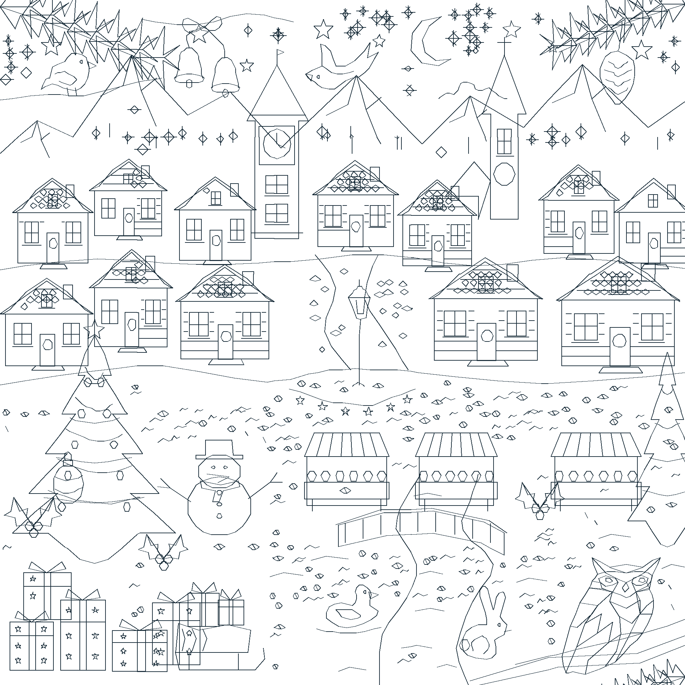

This revision softens natural outlines and gives every daily crop a focal detail: birds, bells, a pine cone, cottages, a lantern, market stalls, gifts and winter wildlife. [Review all 25 completed tiles](runs/advent-organic-village/tile-review.html). The calendar and daily canvases fit the available viewport, including short landscape windows.

The calendar includes the assembled answer, all dots, an animated daily reveal, and the generated composition reference. Click any square or day number to open its unsolved puzzle, with manual drawing, animation, source and connected views. All drawn lines come from the exact daily point data.

- [All dots overview](runs/advent-organic-village/all-dots.png) · [Generated reference](runs/advent-organic-village/generated-reference.png) · [Full vector scene](runs/advent-organic-village/full-scene.svg)
- [25 puzzle sheets (PDF)](runs/advent-organic-village/puzzles.pdf) · [Stroke guides (PDF)](runs/advent-organic-village/stroke-guides.pdf) · [Solutions (PDF)](runs/advent-organic-village/solutions.pdf) · [Assembly map (PDF)](runs/advent-organic-village/assembly.pdf)
- [Calendar process and reproduction](ADVENT_DOT_TO_DOT_DESIGN.md) · [Complete point data](runs/advent-organic-village/calendar.json)

There are **6,075 printed dot locations**; neighbouring sheets repeat shared edge dots. Print A4 at 100% and trim each finished square to assemble a 775×775 mm drawing. Use the separate stroke guides: numbering restarts each day, and each listed stroke requires a pen lift before the next one. This is an artistic feasibility candidate; concealment and daily interest still need human review.

```sh
nix develop -c python -m advent.build --output runs/advent-village-new
nix develop -c python -m unittest discover -s tests
nix develop -c python scripts/test_advent_browser.py
```

[Previous village edition](runs/advent-winter-village/index.html) is preserved for comparison.

## Accepted single-sheet experiment: winter-window


[Open the new unsolved puzzle](runs/dot-to-dot-winter-window/index.html). It uses 243 unique numbered locations, 50 strokes and 277 straight connections. Follow the displayed sequence for each stroke and lift your pen between sequences. Shared locations may be used more than once; this is not one global 1–243 route.

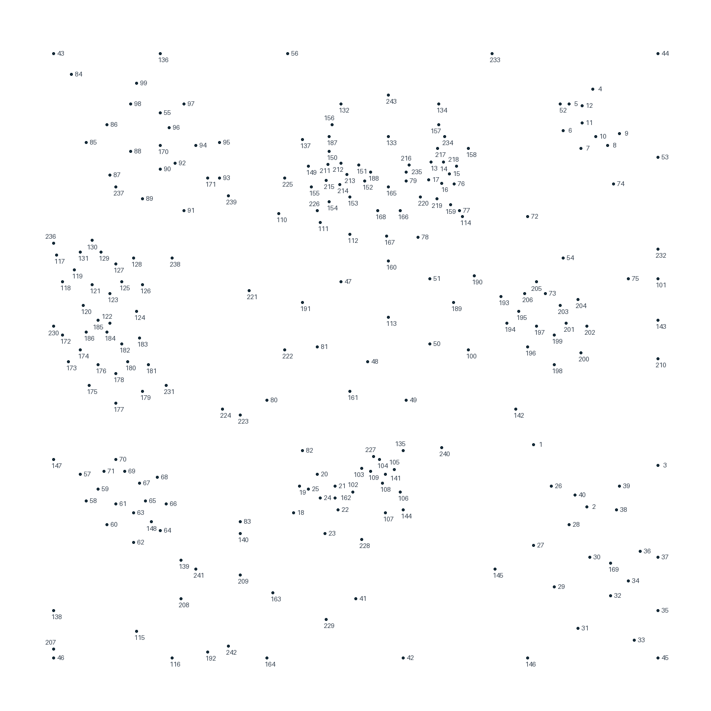

The construction uses sparse corners and interior/background detail instead of evenly sampling a silhouette. Hints are off by default; the answer and source are behind tabs. Concealment still needs a blind human review.

- [Printable dots](runs/dot-to-dot-winter-window/dots.svg) · [Stroke instructions](runs/dot-to-dot-winter-window/instructions.html) · [Exact point and stroke data](runs/dot-to-dot-winter-window/points.json)
- [Connected drawing](runs/dot-to-dot-winter-window/connected.png) · [Final vector source](runs/dot-to-dot-winter-window/source.svg) · [Generated reference](runs/dot-to-dot-winter-window/generated-reference.png)
- [Adult process design](DOT_TO_DOT_ADULT_DESIGN.md)

The final artwork is an authored vector adaptation of the generated reference, not an automatic trace. Every connected segment is present in that vector source. There are no hidden strokes, filler dots, or lines connecting pen lifts.

```sh
nix develop -c python -m dot_to_dot.multistroke --output runs/winter-window-new
```

## Earlier dot-to-dot: the recognisable silhouette

[Open the interactive dot-to-dot](runs/dot-to-dot-reindeer/index.html). It includes source art, dots alone, the completed drawing, animation, a progress scrubber, and manual connect-in-order drawing. It works from disk without a server.

| Generated source | Connected from the 243 points | Same 243 dots, without lines |
| --- | --- | --- |
| 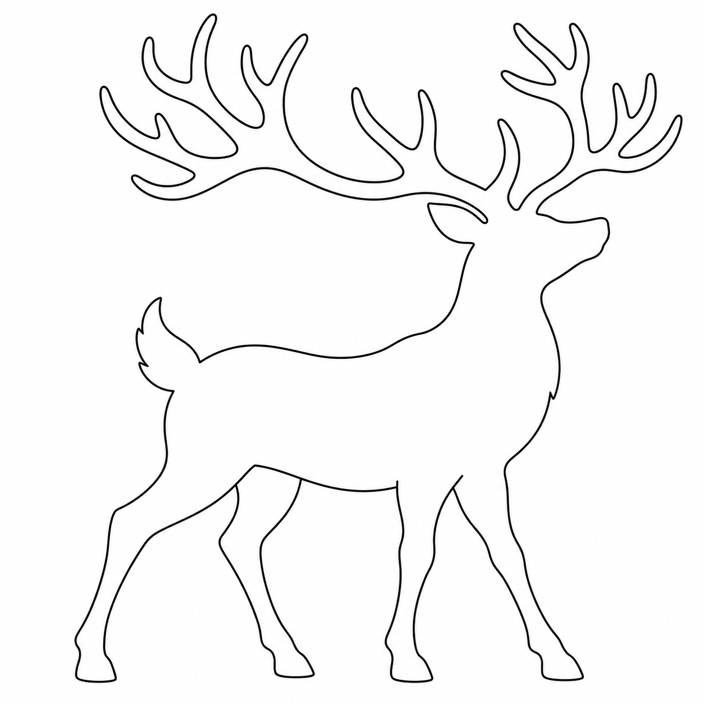 | 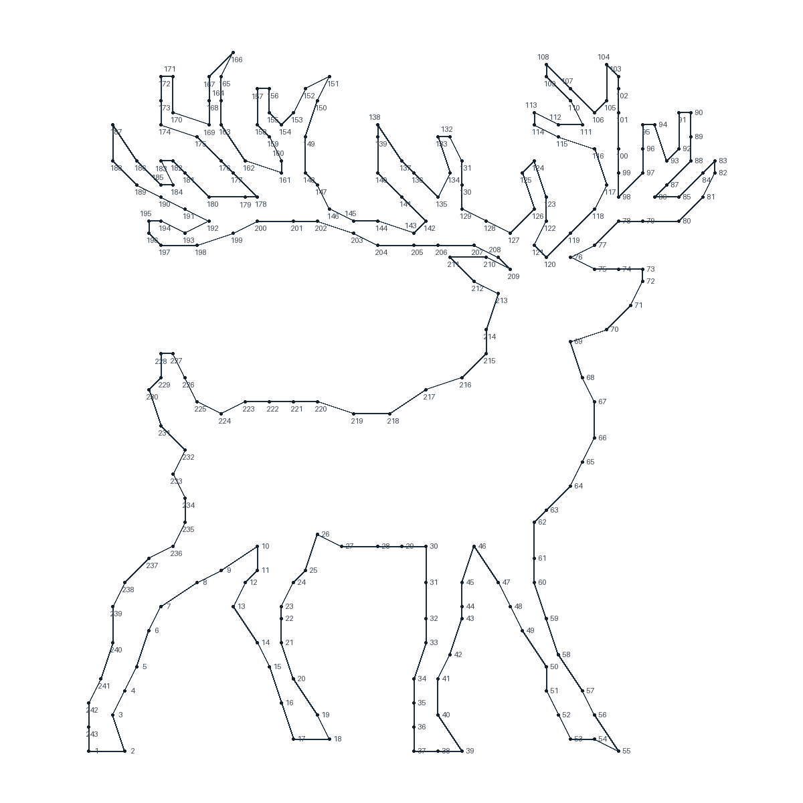 | 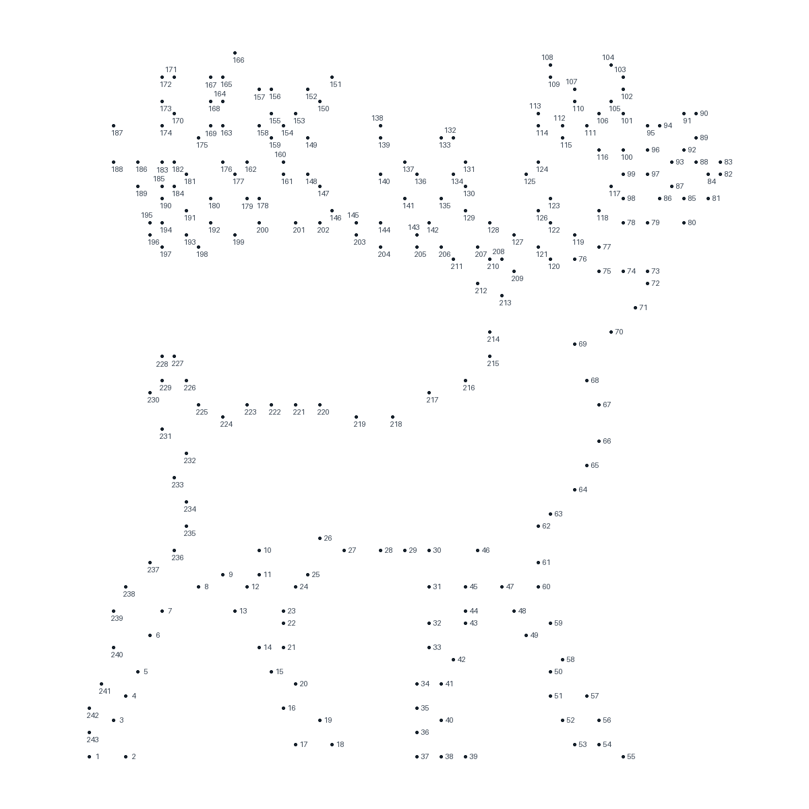 |

All 243 points lie on a regular 18-unit lattice in a 1200×1200 canvas. The route has 243 straight segments, including 243→1 to close it, with no duplicate dots or hidden strokes. The dots still partly reveal the reindeer; grid placement alone has not solved the concealment goal. The original source contains small internal strokes which the outer-contour extraction does not reproduce.

- [Printable dots SVG](runs/dot-to-dot-reindeer/dots.svg) · [Connected SVG](runs/dot-to-dot-reindeer/connected.svg) · [Exact point data](runs/dot-to-dot-reindeer/points.json)
- [New process design](DOT_TO_DOT_DESIGN.md) · [Source prompt](inputs/dot-to-dot/reindeer-prompt.txt)

```sh
nix develop -c python -m dot_to_dot --source inputs/dot-to-dot/reindeer.png --prompt inputs/dot-to-dot/reindeer-prompt.txt --output runs/dot-to-dot-reindeer-new --points 243 --grid 18
```

The mosaic experiments below are preserved as earlier work.

## Earlier mosaic trial: 135×135 village

The same generated village sources have been reprocessed at three times the resolution in each dimension. Each day now contains **729 colour cells** (27×27), arranged as 9×9 groups of 3×3. The full calendar contains **18,225 colour cells**, nine times the original count. These are new samples from the original artwork, not enlarged 45×45 pixels.

| ClickArt | FriXion |
| --- | --- |
| 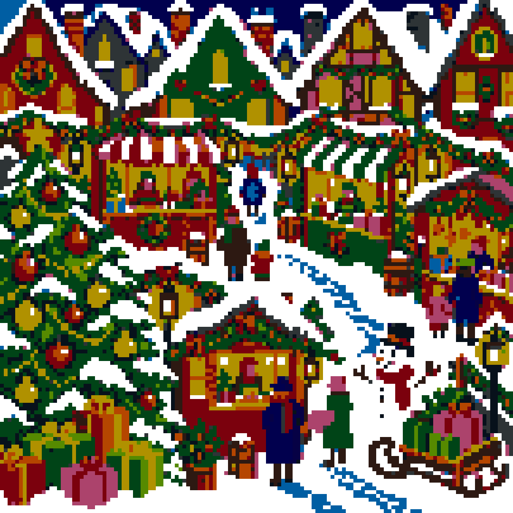 | 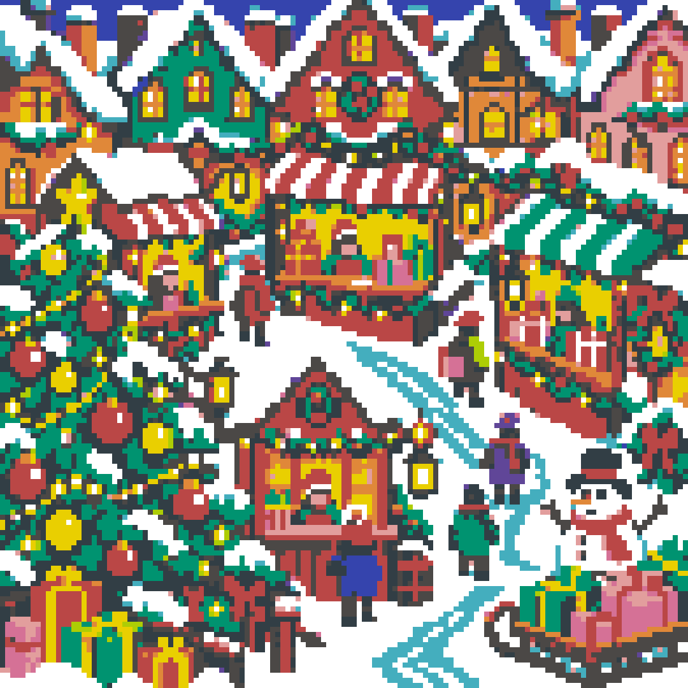 |
| [Exact PNG](runs/clickart-village-135/mosaic.png) · [Daily preview](runs/clickart-village-135/daily-preview.png) | [Exact PNG](runs/frixion-village-135/mosaic.png) · [Daily preview](runs/frixion-village-135/daily-preview.png) |
| [Numbered colouring PDF](runs/clickart-village-135/colouring.pdf) · [Coloured reference PDF](runs/clickart-village-135/assembly.pdf) | [Numbered colouring PDF](runs/frixion-village-135/colouring.pdf) · [Coloured reference PDF](runs/frixion-village-135/assembly.pdf) |

Print PDFs at actual size on A4. Each day has a 27×27 grid with 6 mm cells and heavier lines every three cells, preserving the original 9×9 position layout. Every small cell has its own colour number, 00–12, with a palette legend on the page. The numbered colouring sheets have white cells to fill in; the reference sheets show the finished colours. White is number 00 for these marker palettes. The HTML originals are also included as `colouring.html` and `assembly.html` and can be printed from a browser.

```sh
nix develop -c python -m mosaic build --source inputs/clickart-village.png --palette palettes/clickart.json --generation inputs/clickart-village-generation.json --resampling nearest --subdivision 3 --output runs/clickart-village-135-new
nix develop -c python scripts/review_tiles.py runs/clickart-village-135-new
python3 scripts/print_guides.py runs/clickart-village-135-new
```

The optional PDF exporter uses an installed Chrome/Chromium browser; pass `--browser /path/to/browser` if needed. Substitute `frixion` to use that palette/source. The default `--subdivision 1` retains 45×45 output. At subdivision 3, the source must be at least 135×135. Canonical PNGs remain exactly 135×135; previews enlarge them by an integer factor of eight to 1080×1080. Inventories count the fine colour cells. Both modes use the same 25-day ordering and palette validation.

## Earlier 45×45 village trial

The current direction combines an overall scene with colour variety across the daily tiles: a dense Christmas market street with connected rooftops, stalls, a decorated tree, snowy paths, shoppers and presents. Objects cross tile boundaries naturally; there are no separate panels or backgrounds.

| ClickArt village | FriXion village |
| --- | --- |
| 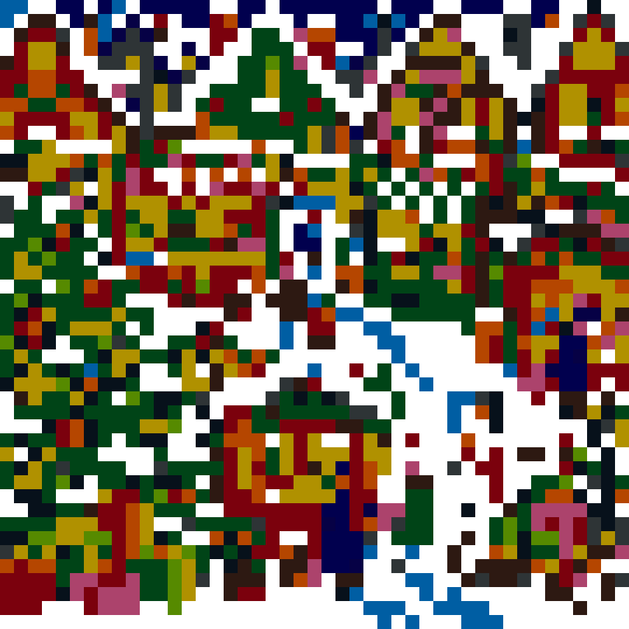 | 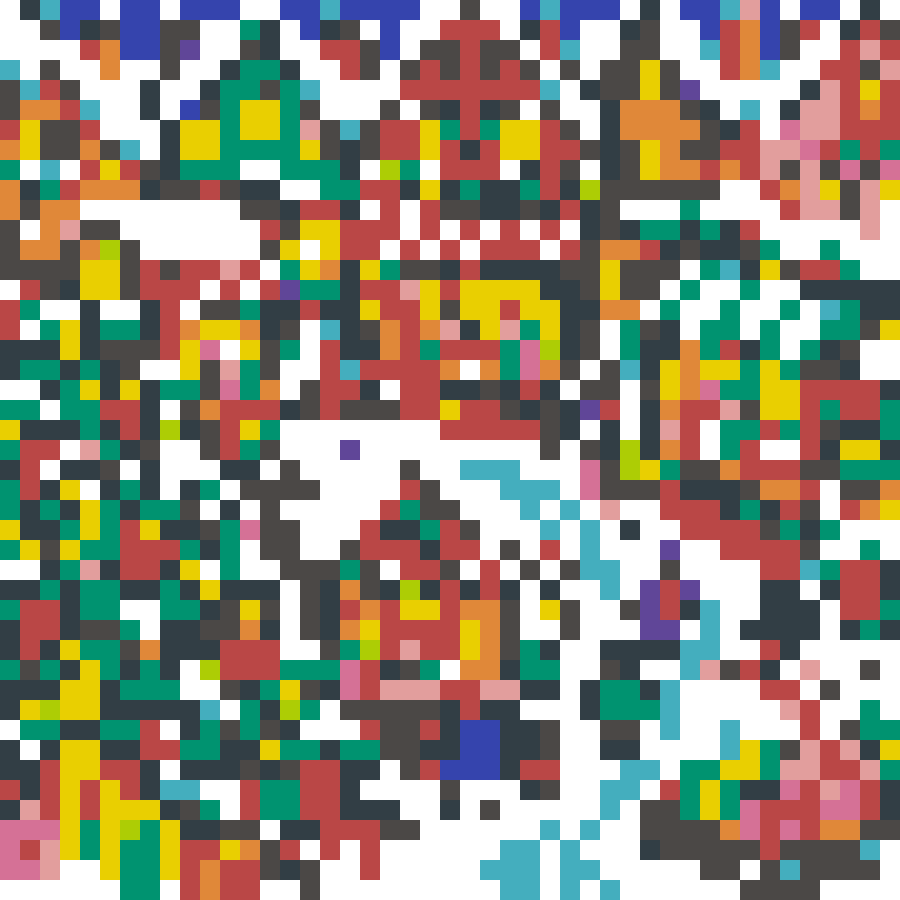 |
| [Individual days](runs/clickart-village/daily-preview.png) · [Exact PNG](runs/clickart-village/mosaic.png) · [Build guide](runs/clickart-village/assembly.html) | [Individual days](runs/frixion-village/daily-preview.png) · [Exact PNG](runs/frixion-village/mosaic.png) · [Build guide](runs/frixion-village/assembly.html) |

Both are exact 45×45 mosaics with 25 validated 9×9 tiles. Every ClickArt tile has at least six colours occupying three or more cells; every FriXion tile has at least five. Small details still become abstract at this resolution. See [village trial notes](runs/VILLAGE_FEASIBILITY.md).

```sh
nix develop -c python -m mosaic build --source inputs/clickart-village.png --palette palettes/clickart.json --generation inputs/clickart-village-generation.json --resampling nearest --output runs/clickart-village-new
nix develop -c python scripts/review_tiles.py runs/clickart-village-new
```

## Earlier sampler trial: a picture for each day

The landscape trial left too many days blank or meaningless on their own. The new artwork is a Christmas sampler: 25 small motifs aligned to the 25 daily tiles. Each full mosaic is still exactly 45×45, using its marker palette plus white.

| ClickArt sampler | FriXion sampler |
| --- | --- |
| 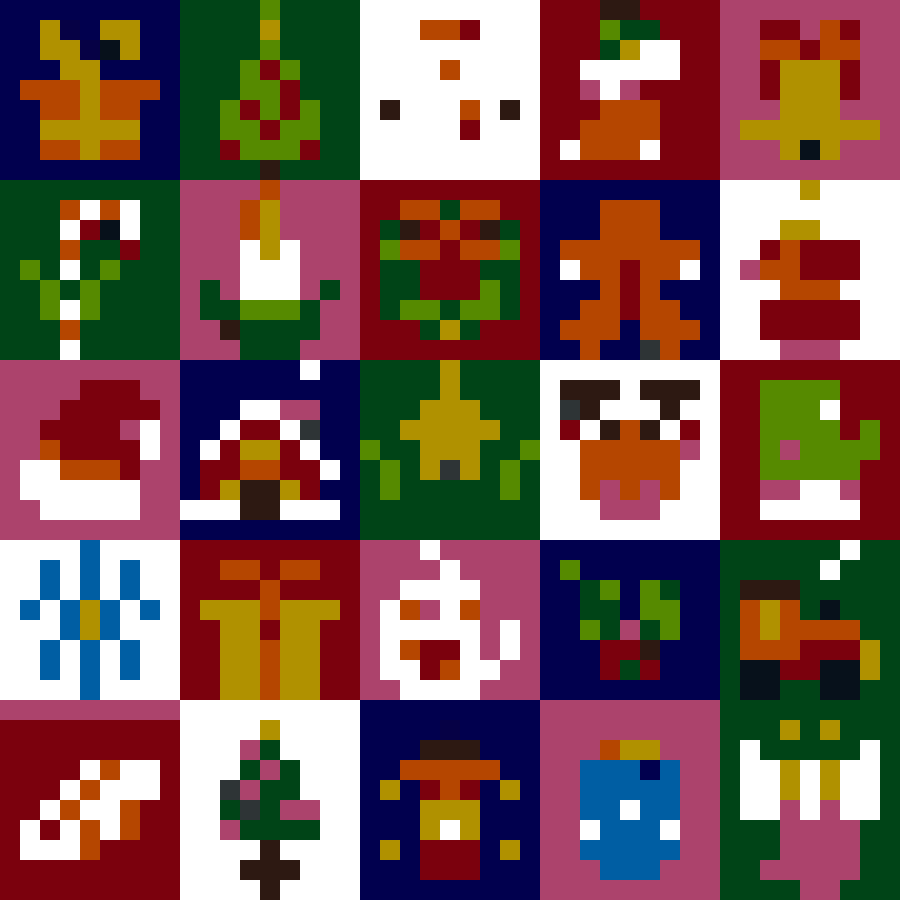 | 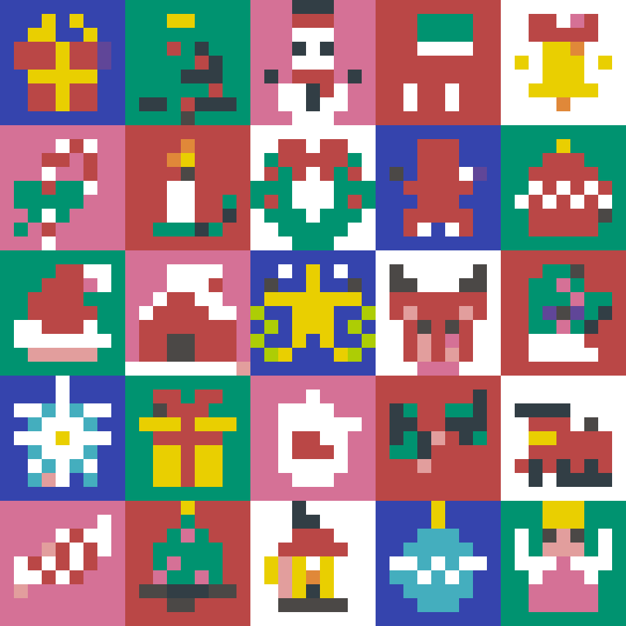 |
| [Individual days](runs/clickart-sampler-nearest/daily-preview.png) · [Exact PNG](runs/clickart-sampler-nearest/mosaic.png) · [Build guide](runs/clickart-sampler-nearest/assembly.html) | [Individual days](runs/frixion-sampler-nearest/daily-preview.png) · [Exact PNG](runs/frixion-sampler-nearest/mosaic.png) · [Build guide](runs/frixion-sampler-nearest/assembly.html) |

These runs use `--resampling nearest` to preserve the generated flat-colour shapes. BOX remains the default and its comparison runs are preserved as `runs/clickart-sampler` and `runs/frixion-sampler`. Nearest sampling avoids averaged edge colours but may lose small details. [Sampler trial notes](runs/SAMPLER_FEASIBILITY.md) describe daily colour counts and remaining limitations.

```sh
nix develop -c python -m mosaic build --source inputs/clickart-sampler.png --palette palettes/clickart.json --generation inputs/clickart-sampler-generation.json --resampling nearest --output runs/clickart-sampler-new
nix develop -c python scripts/review_tiles.py runs/clickart-sampler-new
```

The review command creates a separated daily preview and `tile-review.json`. It reports distinct colours, colours occupying at least three cells, and the largest colour share per tile. These help detect boring days but do not measure recognisability.

## Earlier landscape examples

These previews enlarge the actual 45×45 outputs by exactly 20× without smoothing.

| ClickArt | FriXion |
| --- | --- |
| 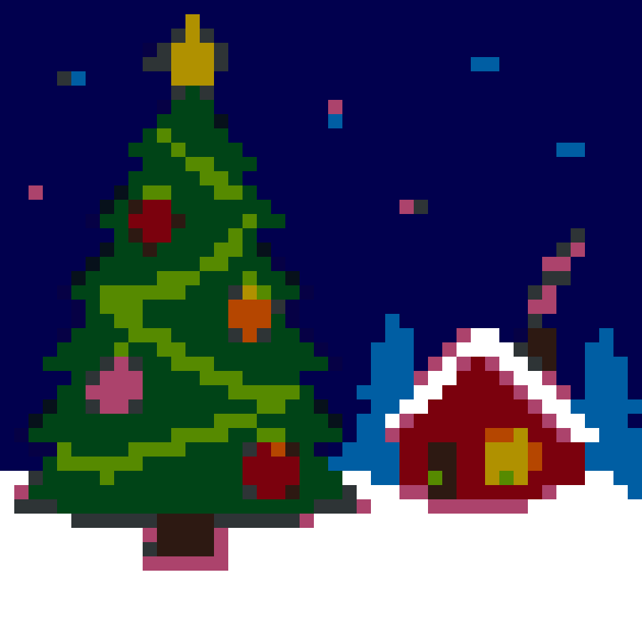 | 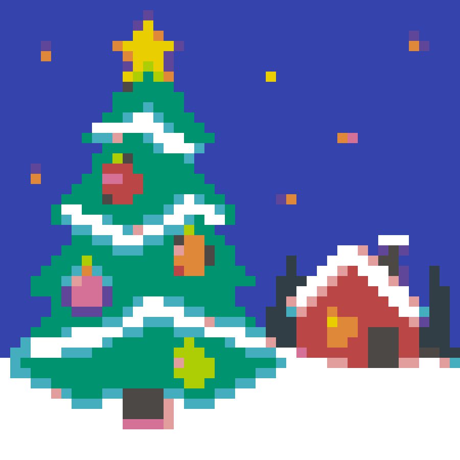 |
| [Exact PNG](runs/clickart-christmas/mosaic.png) · [Printable guide](runs/clickart-christmas/assembly.html) · [Inventory](runs/clickart-christmas/inventory.csv) | [Exact PNG](runs/frixion-christmas/mosaic.png) · [Printable guide](runs/frixion-christmas/assembly.html) · [Inventory](runs/frixion-christmas/inventory.csv) |

Both outputs pass automated validation. [Trial notes](runs/FEASIBILITY.md) record limitations; human recognition and assembly trials remain pending. Original generated images, exact prompts, and available generation metadata are saved under [inputs](inputs/).

## Build and validate

From this directory, use the pinned Nix environment (Python and Pillow):

```sh
nix develop -c python -m mosaic build --source inputs/clickart.png --palette palettes/clickart.json --generation inputs/clickart-generation.json --output runs/clickart-new
nix develop -c python -m mosaic validate runs/clickart-christmas
nix develop -c python -m unittest discover -s tests -v
```

For FriXion, substitute `frixion` in the input/palette paths and choose a new output directory. `--generation` is optional for imported sources. Existing outputs are never overwritten. Non-square sources fail unless `--centre-crop` is explicitly supplied; images smaller than 45×45 are rejected.

Every run contains preserved source bytes, normalized and reduced images, an exact palette snapshot, `mosaic.json`, `mosaic.png`, `preview.png`, 25 tile PNGs, `assembly.html`, `inventory.csv`, and `run.json`. Open `assembly.html` in a browser to view or print the self-contained day-by-day guides. White counts as a filled position. Run metadata records conversion settings, dependency versions, source hash, processing time, and validation results.

## Extracted marker palettes

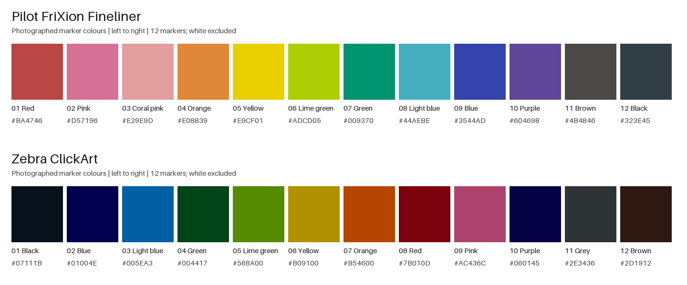

Each row contains exactly 12 colours, ordered left to right as the markers appear in the supplied product photograph. Values are sampled from the coloured plastic, avoiding lettering and glare, using the median of each RGB channel. They match the photographed appearance rather than calibrated ink on paper. Colour names are descriptive.

- [Both palettes in one JSON file](palettes/palettes.json)
- FriXion: [palette JSON](palettes/frixion.json), [swatch](palettes/frixion-swatch.png), [sample locations](palettes/frixion-samples.png)
- ClickArt: [palette JSON](palettes/clickart.json), [swatch](palettes/clickart-swatch.png), [sample locations](palettes/clickart-samples.png)

In each JSON palette, `colours` contains the 12 markers (`C01`–`C12` in pictured order). `additional_mosaic_colour` supplies pure white (`C00`) separately. The converter automatically prepends that white entry, producing its required 13-entry array. It also accepts normalized 13-entry palettes such as each run’s `palette.json`. IDs are local to each marker set: always retain the palette ID with mosaic data.

Reproduce the extraction and all swatches with the pinned Pillow environment:

```sh
nix develop -c python scripts/extract_palettes.py
```

The script records source hashes and exact sampling rectangles in the JSON files and checks that swatch pixels equal their RGB values. It converts embedded colour profiles to sRGB, with no exposure or saturation adjustment.

## First project: an advent calendar

The first picture is a simple Christmas scene: a decorated evergreen tree beside a small red cabin, with snow and a dark blue sky. Large shapes and strong contrast should keep the scene recognisable at 45×45 pixels.

The initial calendar uses one tile per day, December 1–25, revealed left to right and top to bottom. This is an explicit MVP assumption: a 24-day calendar would need a separate decision about the twenty-fifth tile.

## Workflow

1. Generate a square source illustration using the prompt in the design. Save the original image and generation details.
2. Normalize the image and reduce it to exactly 45×45 pixels.
3. Map each pixel to its nearest colour in the fixed 13-entry palette, with no dithering.
4. Export the exact mosaic, an enlarged preview, 25 tile patterns, colour counts, and a machine-readable cell map.
5. Check all dimensions and colours automatically, then assess whether people recognise the scene and can follow the tile patterns.

The image generator supplies the artwork. The processing pipeline guarantees the grid and palette. A request for “pixel art” alone cannot guarantee either.

## Required result

| Property | Requirement |
| --- | --- |
| Finished image | Exactly 45×45 pixels; opaque, lossless PNG |
| Physical layout | 5×5 tiles, each with 9×9 cells |
| Cell count | 2,025 total; 81 per tile |
| Allowed colours | A fixed set of 12 non-white colours plus white |
| Colour per cell | Exactly one palette entry; white is a filled cell |
| Palette usage | Any subset of the 13 entries is valid |
| Build aids | Labelled tile guides, tile/day map, and per-colour piece counts |

The design includes an initial provisional palette; the extracted marker sets above now provide two concrete alternatives for the first digital trial. Confirm colours against marks on paper before evaluating a physical build. There are no assumed stock limits in the MVP.

## Feasibility question

Can a generated Christmas scene remain recognisable and practical to assemble after reduction to 2,025 cells and the available colours? This requested trial supplies two independently generated scenes, one per palette, with strict output validation. The broader design proposes three candidates per experiment and a small human review. A technically valid image is necessary, but visual recognition and usable instructions determine whether the approach is worth continuing.
